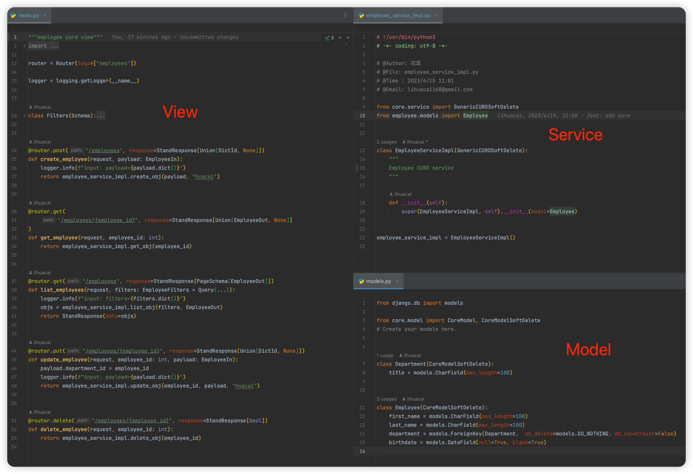
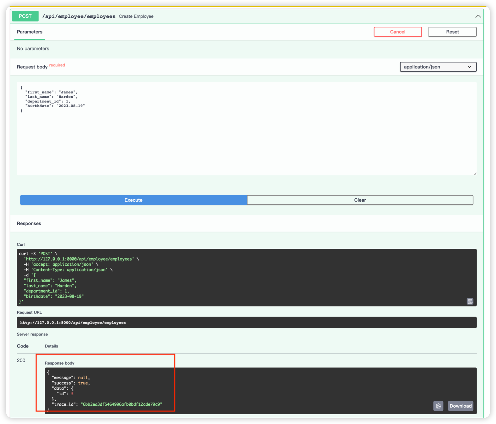
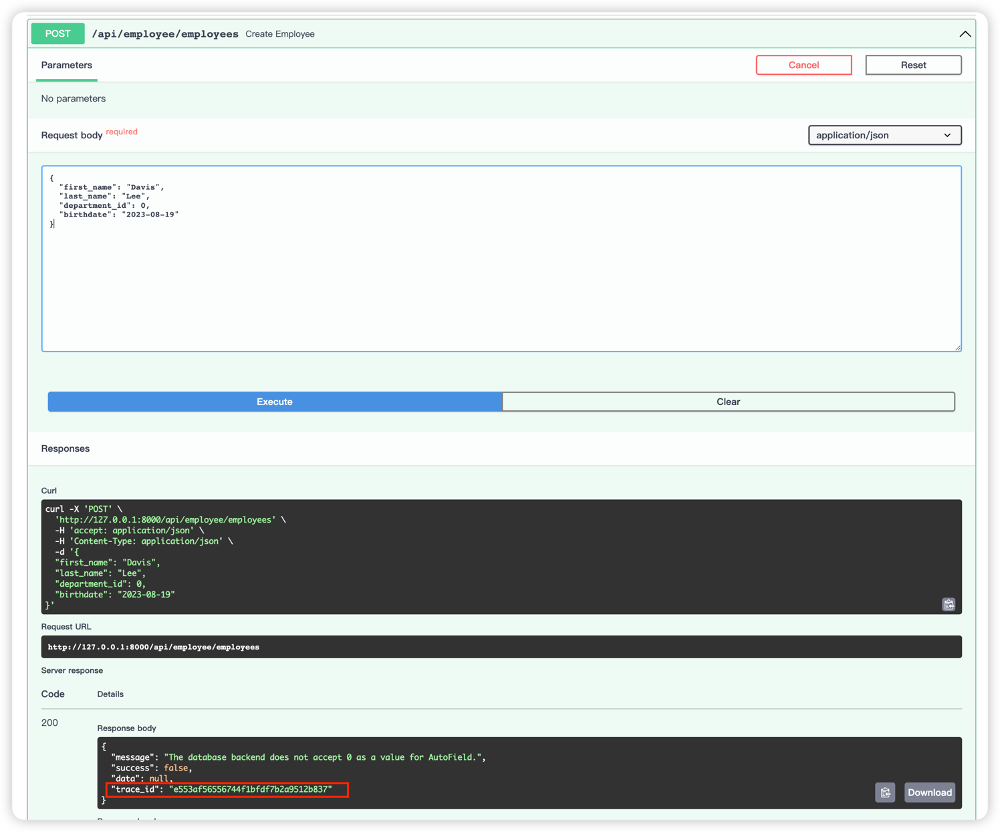
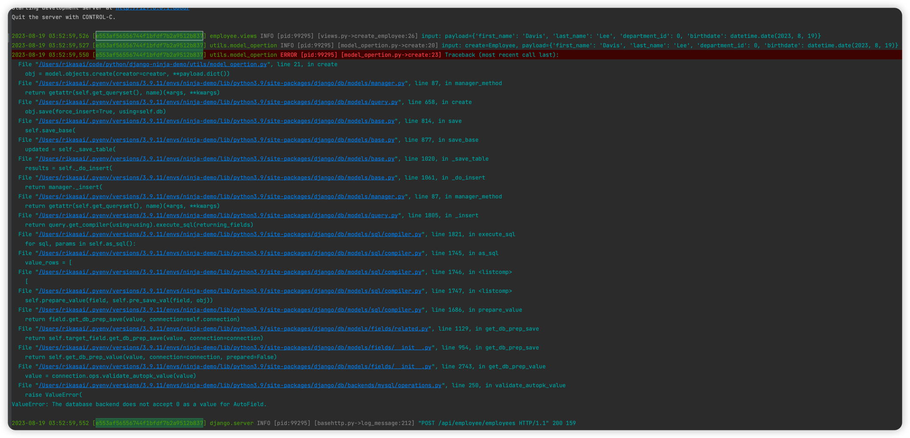
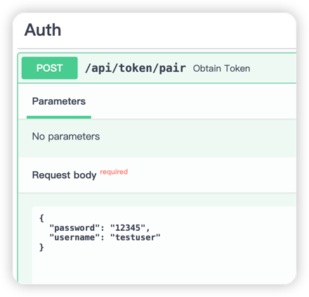
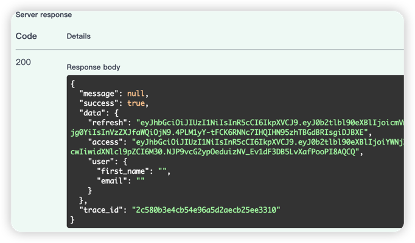
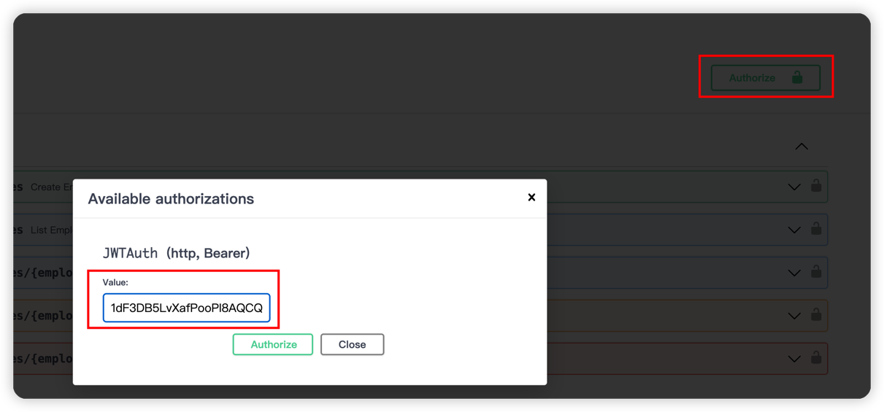
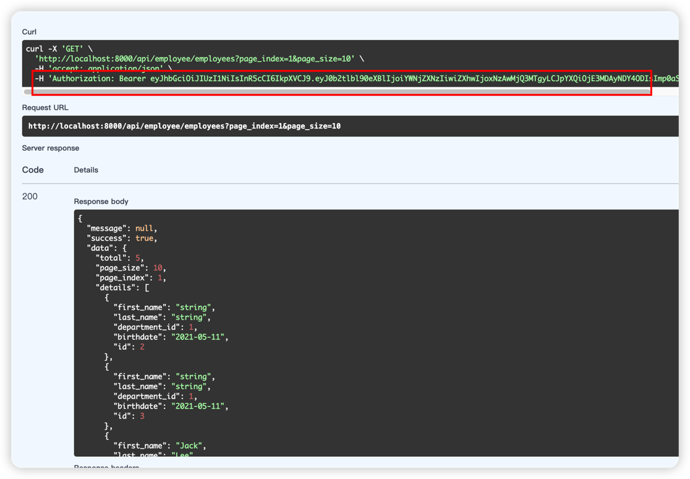

# Features
- Easy and fast CURD
- Stand format response
- Log and response trace_id






# Quick start
## Clone code
`git clone https://github.com/lihuacai168/django-ninja-demo.git`


## Docker-compose

```shell
# set env
cp .env.example .env
```

## Make sure db have migrated
    
```shell
# start app
docker-compose -f docker-compose-without-db.yml --env-file=${PWD}/.env up --build
```


## Local Dev

## Create virtualenv
```
python3 -m venv venv
```

## Activate virtualenv
```
source venv/bin/activate
```

## Install dependencies
```
cd django-ninja-demo && pip install -r requirements.txt
```

## Migrate db
```
python manage.py migrate
```

## Start app
```
python manage.py runserver localhost:8000
```

## Open api docs [open in browser](http://localhost:8000/api/docs)


## Obtain access token




## Authorize and request API


