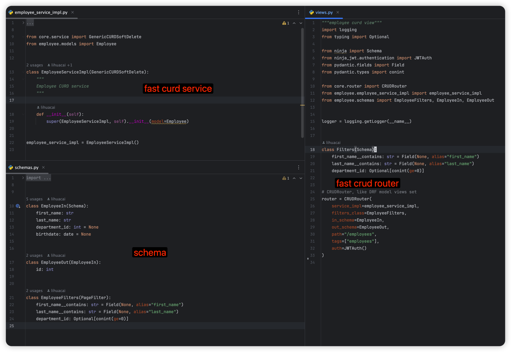
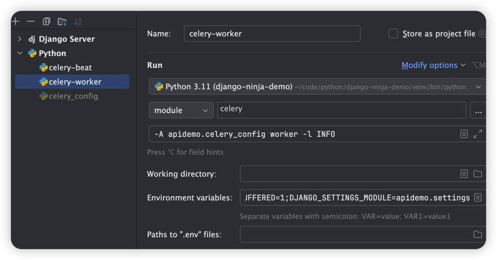
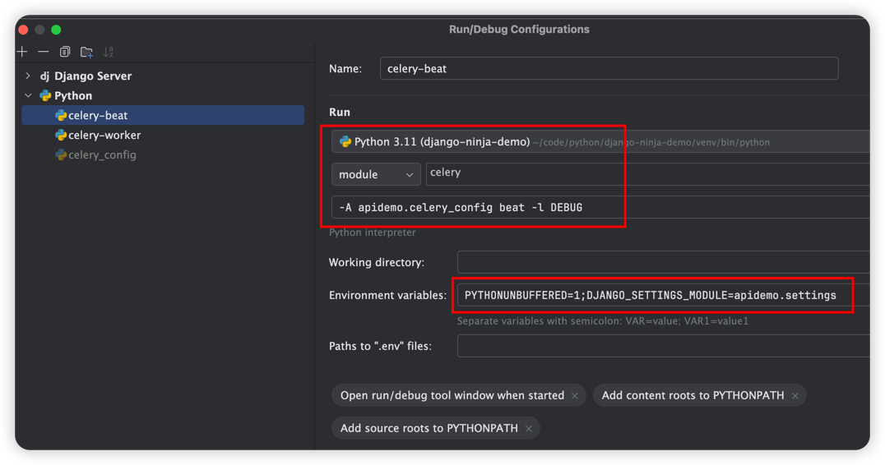

[](https://github.com/lihuacai168/django-ninja-demo/actions)
[](https://app.codecov.io/gh/lihuacai168/django-ninja-demo)


# Key Features
- 🛡️ **High Coverage: Rigorous unit tests for robust codebase assurance.**
- 😊 **Fast CRUD Router: Quick and easy create, read, update, and delete operations.**
- ✅ **Uniform API: Consistent responses throughout the service.**
- 🔍 **Trace IDs:  Simplified issue tracking with trace IDs in logs**
- 🚀 **Modern Dependency Management: Using uv for fast and reliable Python package management**



# Quick start
## Clone code
```shell
git clone https://github.com/lihuacai168/django-ninja-demo.git
cd django-ninja-demo
```

## Local Development

### Install uv
```shell
# On macOS/Linux
curl -LsSf https://astral.sh/uv/install.sh | sh

# On Windows
powershell -c "irm https://astral.sh/uv/install.ps1 | iex"
```

### Setup Development Environment
```shell
# Create virtual environment and activate it
uv venv
source .venv/bin/activate  # Linux/macOS
# or
.venv\Scripts\activate  # Windows

# Install all dependencies (including dev dependencies)
uv sync

# Or install without dev dependencies for production
uv sync --no-dev
```

### Database Setup
```shell
python manage.py migrate
```

### Start Development Server
```shell
python manage.py runserver localhost:8000
```

## Docker Deployment

### Environment Setup
```shell
# Copy environment configuration
cp .env.example .env
```

### Build and Run
```shell
# Build and start the application
docker-compose -f docker-compose-without-db.yml --env-file=${PWD}/.env up --build
```

## API Documentation
Visit [http://localhost:8000/api/docs](http://localhost:8000/api/docs) in your browser to view the API documentation.

## Authentication

### Obtain Access Token


### Authorize and Request API


# Celery Integration

## Configure Celery Broker
```python
# setting.py
broker_url = "redis://127.0.0.1:6379/0"
```

## Run Celery Worker
```shell
# Start celery worker
python -m celery -A apidemo.celery_config worker -l INFO
```

## Run Celery Beat
```shell
# Start celery beat
python -m celery -A apidemo.celery_config beat -l DEBUG
```

## IDE Configuration
### PyCharm Celery Worker Configuration


### PyCharm Celery Beat Configuration


# Development Notes

## Dependency Management
- Dependencies are managed through `pyproject.toml`
- Use `uv sync` to install dependencies
- Use `uv sync --upgrade` to upgrade dependencies
- Use `uv sync --no-dev` for production environments

## Testing
```shell
# Run tests with coverage
coverage run --source='.' manage.py test

# Generate coverage report
coverage xml
```